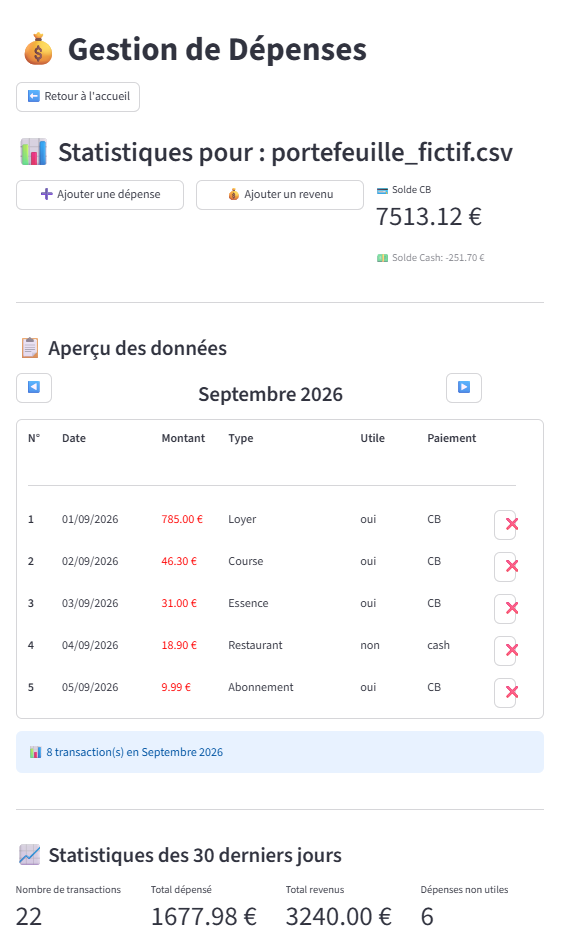
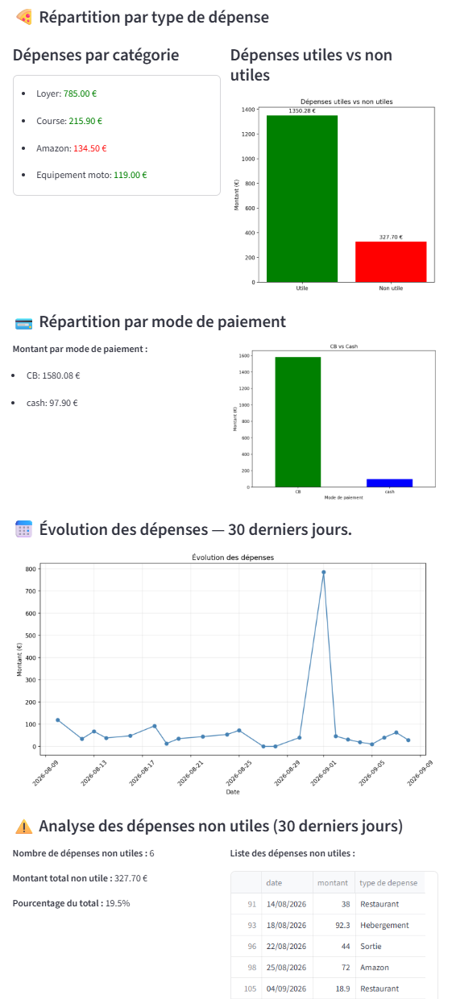

# Personal Expense Tracker

## Project Overview

I originally built this application to manage my personal expenses when I was regularly using both **cash and card payments**.

The goal was to keep track of transactions across both payment methods in one place, while maintaining separate balances for **Cash** and **Card**.

The application allows users to add income and expenses, delete transactions, navigate activity by month, and analyze recent spending patterns through statistics and visualizations.

For this portfolio version, the application uses a **fictional dataset**.

---

## Features

- Add new expenses
- Add new income
- Delete transactions
- Navigate transactions month by month
- Track Cash and Card transactions separately
- Maintain separate Cash and Card balances
- Analyze the last 30 days of activity
- Compare useful vs non-useful expenses
- Analyze spending by category
- Compare Card vs Cash payments
- Visualize spending evolution over time
- Review non-useful expenses in detail

---

## Tools Used

- Python
- Streamlit
- pandas
- matplotlib
- CSV files

---

## Application Overview



The main interface provides:

- Current Card and Cash balances
- Monthly transaction navigation
- Transaction history
- Expense and income creation
- Transaction deletion
- 30-day KPIs

---

## Spending Analysis



The analytical section includes:

- Number of transactions
- Total expenses
- Total income
- Number of non-useful expenses
- Spending by category
- Useful vs non-useful expense comparison
- Payment method distribution
- 30-day spending trend
- Detailed list of non-useful expenses

---

## Data Structure

The application uses CSV files with the following structure:

```text
date,montant,type de depense,utile (yes/no),cash ou CB
```

Example:

```text
01/09/26,-785.0,Loyer,oui,CB
02/09/26,-46.3,Course,oui,CB
03/09/26,-31.0,Essence,oui,CB
```

Negative values represent expenses and positive values represent income.

The `cash ou CB` field is used to keep track of the payment method and maintain separate balances for both.

---

## Repository Structure

```text
personal-expense-tracker/
│
├── app.py
├── requirements.txt
├── README.md
│
├── data/
│   └── portefeuille_fictif.csv
│
└── screenshots/
    ├── expense_tracker_overview.png
    └── expense_tracker_statistics.png
```

---

## How to Run

Install the required packages:

```bash
pip install -r requirements.txt
```

Run the Streamlit application:

```bash
streamlit run app.py
```

---

## Limitations

- Data is stored locally in CSV files rather than a database.
- The application does not include user authentication.
- Expense usefulness is manually classified as `oui` or `non`.
- The current analysis focuses mainly on the last 30 days.
- The demo dataset included in this repository is fictional.

---

## Author

**Maxime Orlhac**

Data / Business Analyst Portfolio Project
